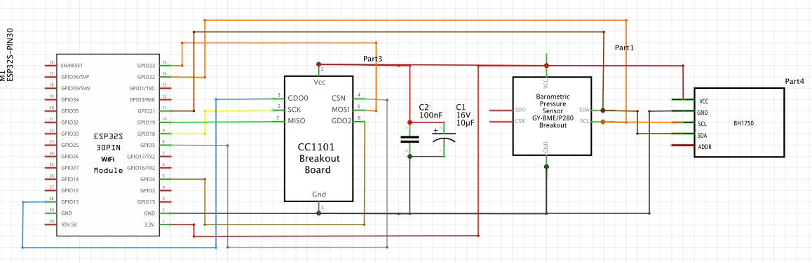

This is an attempt at creating an Arduino library for use on ESP32 boards with a CC1101 transceiver with the device decoders from the rtl_433 package.  And be available for use with openMQTTGateway as an available module.

Inspiration for this came from the ESPiLight effort.  Kudos to @puuu for this, and the awesome package.

The initial port implements only enables a subset of the available modulations and device decoders, and is limited to devices I have access to and can test with.

## Enabled Pulse Demodulation modules

```
	OOK_PPM :         Pulse Position Modulation ( ASK )
	OOK_PWM :         Pulse Width Modulation ( ASK )
  FSK_PULSE_PCM:    Frequency Shift Keying ( 2-FSK )
```

## Receiving different signal modulations

Unlike the rtl-sdr device which passes the raw RF signal to rtl_433 for processing and demodulation, the CC1101 Transceiver performs signal demodulation on the device itself, so recepition of different modulations is limited to the currently selected modulation scheme.  Simultaneous reception of signals encoded with different modulation schemes is not feasible with a CC1101 Transceiver.

### Enabled Device Decoders

```
Registering protocol [2] "Acurite 609TXC Temperature and Humidity Sensor"
Registering protocol [3] "Acurite 592TXR Temp/Humidity, 5n1 Weather Station, 6045 Lightning, 3N1, Atlas"
Registering protocol [4] "Acurite 986 Refrigerator / Freezer Thermometer"
Registering protocol [5] "Acurite 606TX Temperature Sensor"
Registering protocol [6] "Acurite 00275rm,00276rm Temp/Humidity with optional probe"
Registering protocol [7] "Acurite 590TX Temperature with optional Humidity"
Registering protocol [8] "Akhan 100F14 remote keyless entry"
Registering protocol [9] "AlectoV1 Weather Sensor (Alecto WS3500 WS4500 Ventus W155/W044 Oregon)"
Registering protocol [10] "Ambient Weather TX-8300 Temperature/Humidity Sensor"
Registering protocol [11] "Ambient Weather WH31E Thermo-Hygrometer Sensor, EcoWitt WH40 rain gauge"
Registering protocol [12] "TBH weather sensor"
Registering protocol [13] "Auriol AFW2A1 temperature/humidity sensor"
Registering protocol [14] "Auriol AHFL temperature/humidity sensor"
Registering protocol [15] "Auriol HG02832, HG05124A-DCF, Rubicson 48957 temperature/humidity sensor"
Registering protocol [16] "BlueLine Power Monitor"
Registering protocol [17] "Blyss DC5-UK-WH"
Registering protocol [19] "Bresser Thermo-/Hygro-Sensor 3CH"
Registering protocol [20] "Bresser Weather Center 5-in-1"
Registering protocol [21] "Bresser Weather Center 6-in-1, 7-in-1 indoor, new 5-in-1, 3-in-1 wind gauge, Froggit WH6000, Ventus C8488A"
Registering protocol [22] "Bresser Weather Center 7-in-1"
Registering protocol [24] "Burnhard BBQ thermometer"
Registering protocol [25] "Calibeur RF-104 Sensor"
Registering protocol [26] "Cardin S466-TX2"
Registering protocol [27] "Chuango Security Technology"
Registering protocol [28] "Companion WTR001 Temperature Sensor"
Registering protocol [29] "Danfoss CFR Thermostat"
Registering protocol [31] "DirecTV RC66RX Remote Control"
Registering protocol [33] "EcoDHOME Smart Socket and MCEE Solar monitor"
Registering protocol [34] "Ecowitt Wireless Outdoor Thermometer WH53/WH0280/WH0281A"
Registering protocol [35] "Eurochron EFTH-800 temperature and humidity sensor"
Registering protocol [39] "emonTx OpenEnergyMonitor"
Registering protocol [40] "ESIC EMT7110 power meter"
Registering protocol [41] "Esperanza EWS"
Registering protocol [43] "Fine Offset Electronics, WH2, WH5, Telldus Temperature/Humidity/Rain Sensor"
Registering protocol [44] "Fine Offset Electronics, WH25, WH32B, WH24, WH65B, HP1000 Temperature/Humidity/Pressure Sensor"
Registering protocol [45] "Fine Offset Electronics/ECOWITT WH51 Soil Moisture Sensor"
Registering protocol [46] "Fine Offset Electronics, WH0530 Temperature/Rain Sensor"
Registering protocol [47] "Fine Offset WH1050 Weather Station"
Registering protocol [48] "Fine Offset Electronics WH1080/WH3080 Weather Station"
Registering protocol [49] "Fine Offset Electronics WH1080/WH3080 Weather Station (FSK)"
Registering protocol [51] "FT-004-B Temperature Sensor"
Registering protocol [52] "Generic wireless motion sensor"
Registering protocol [53] "Generic Remote SC226x EV1527"
Registering protocol [54] "Generic temperature sensor 1"
Registering protocol [55] "Globaltronics QUIGG GT-TMBBQ-05"
Registering protocol [56] "Globaltronics GT-WT-02 Sensor"
Registering protocol [57] "Globaltronics GT-WT-03 Sensor"
Registering protocol [58] "Microchip HCS200 KeeLoq Hopping Encoder based remotes"
Registering protocol [59] "Holman Industries iWeather WS5029 weather station (newer PCM)"
Registering protocol [60] "Honeywell ActivLink, Wireless Doorbell"
Registering protocol [61] "HT680 Remote control"
Registering protocol [62] "IKEA Sparsnas Energy Meter Monitor"
Registering protocol [63] "inFactory, nor-tec, FreeTec NC-3982-913 temperature humidity sensor"
Registering protocol [65] "Interlogix GE UTC Security Devices"
Registering protocol [67] "Kedsum Temperature & Humidity Sensor, Pearl NC-7415"
Registering protocol [68] "Kerui PIR / Contact Sensor"
Registering protocol [69] "LaCrosse TX Temperature / Humidity Sensor"
Registering protocol [70] "LaCrosse Technology View LTV-WSDTH01 Breeze Pro Wind Sensor"
Registering protocol [71] "LaCrosse Technology View LTV-R1 Rainfall Gauge"
Registering protocol [72] "LaCrosse Technology View LTV-TH Thermo/Hygro Sensor"
Registering protocol [73] "LaCrosse TX141-Bv2, TX141TH-Bv2, TX141-Bv3, TX141W, TX145wsdth sensor"
Registering protocol [74] "LaCrosse TX29IT, TFA Dostmann 30.3159.IT Temperature sensor"
Registering protocol [75] "LaCrosse TX35DTH-IT, TFA Dostmann 30.3155 Temperature/Humidity sensor"
Registering protocol [76] "LaCrosse Technology View LTV-WR1 Multi Sensor"
Registering protocol [77] "LaCrosse/ELV/Conrad WS7000/WS2500 weather sensors"
Registering protocol [78] "LaCrosse WS-2310 / WS-3600 Weather Station"
Registering protocol [80] "Maverick et73"
Registering protocol [82] "Missil ML0757 weather station"
Registering protocol [84] "Nexus, FreeTec NC-7345, NX-3980, Solight TE82S, TFA 30.3209 temperature/humidity sensor"
Registering protocol [86] "Opus/Imagintronix XT300 Soil Moisture"
Registering protocol [87] "Oregon Scientific SL109H Remote Thermal Hygro Sensor"
Registering protocol [88] "OSv1 Temperature Sensor"
Registering protocol [89] "Philips outdoor temperature sensor (type AJ3650)"
Registering protocol [90] "Philips outdoor temperature sensor (type AJ7010)"
Registering protocol [91] "Prologue, FreeTec NC-7104, NC-7159-675 temperature sensor"
Registering protocol [92] "Quhwa"
Registering protocol [94] "Rubicson Temperature Sensor"
Registering protocol [95] "Rubicson 48659 Thermometer"
Registering protocol [96] "Conrad S3318P, FreeTec NC-5849-913 temperature humidity sensor"
Registering protocol [97] "Silvercrest Remote Control"
Registering protocol [98] "Skylink HA-434TL motion sensor"
Registering protocol [99] "Wireless Smoke and Heat Detector GS 558"
Registering protocol [100] "Solight TE44/TE66, EMOS E0107T, NX-6876-917"
Registering protocol [101] "Springfield Temperature and Soil Moisture"
Registering protocol [102] "TFA Dostmann 30.3221.02 T/H Outdoor Sensor"
Registering protocol [103] "TFA Drop Rain Gauge 30.3233.01"
Registering protocol [104] "TFA Marbella Pool Thermometer"
Registering protocol [105] "TFA pool temperature sensor"
Registering protocol [106] "TFA-Twin-Plus-30.3049, Conrad KW9010, Ea2 BL999"
Registering protocol [107] "Thermopro TP11 Thermometer"
Registering protocol [108] "Thermopro TP08/TP12/TP20 thermometer"
Registering protocol [110] "TS-FT002 Wireless Ultrasonic Tank Liquid Level Meter With Temperature Sensor"
Registering protocol [111] "Visonic powercode"
Registering protocol [112] "Waveman Switch Transmitter"
Registering protocol [113] "WG-PB12V1 Temperature Sensor"
Registering protocol [114] "WS2032 weather station"
Registering protocol [115] "Hyundai WS SENZOR Remote Temperature Sensor"
Registering protocol [116] "WT0124 Pool Thermometer"
Registering protocol [118] "X10 Security"
```

The gaps in the numbers are device decoders disabled by default.

## Wiring and Building the Example

This is the diagram I'm using with my devices.



In my units that I have built with the openMQTTGateway firmware I have included a BME280 Temperature Sensor and a BH1750 Light LUX Sensor.  The two sensors are purely optional and you do not need to include them in your builds.

And to build the example I use platformio and opened the example folder as a new window and built from their.

## Projects using the library

* OpenMQTTGateway - https://github.com/1technophile/OpenMQTTGateway
  - ASK Support is currently available in the production branch

## Roadmap / Next Steps

* [ ] Firmware size tuning
* [ ] Further heap usage tuning
* [x] Find stack leak when running all devices
* [ ] Enable addition pulse demod functions
* [ ] Enable FSK enabled devices
* [ ] Add support for SX1276 SX1278 ESP32 LoRa 868MHz/915MHz/433MH based receiver boards

## Compile definition options

```
MY_DEVICES					; Only include my personal subset of devices

CC1101_GDO0         ; gpio pin that is connected to GDO0 on the CC1101
CC1101_GDO2         ; gpio pin that is connected to GDO2 on the CC1101
DEMOD_DEBUG					; enable verbose debugging of signal processing
DEVICE_DEBUG				; Validate fields are mapped to response object ( rtl_433 )
MEMORY_DEBUG				; display heap usage information
RAW_SIGNAL_DEBUG			; display raw received messages
RSSI						; Enable collection of per pulse RSSI Values during signal reception
RTL_DEBUG					; Enable RTL_433 Verbose option ( 0=normal, 1=verbose, 2=verbose decoders, 3=debug decoders, 4=trace decoding. )
SUPPRESS_UNPARSED			; Enable suppression of publishing MQTT messages for unparsed signals, e.g. {model":"unknown","protocol":"signal parsing failed"…
```

## Porting approach

* Copy subset of files in src/rtl_433/devices without any modification
  - Generated a list of files that used OOK_PPM and OOK_PWM with tools/device.awk
  - Copied into src/rtl_433/devices
  - Marked newkaku.c, nexa.c, and proove.c as unavailable as the device decoder triggers a stack overflow
  - Based on the reduced list, updated include/rtl_433_devices.h, src/rtl_433_ESP.cpp, and src/rtl_433_ESP.h

* Copy of only used files in src/rtl_433, with minimal modifications
- abuf.c 			- No changes made
- bitbuffer.c		- No changes made 
- data.c			- Defined out unneeded functions ( #ifndef ESP32 )
- decoder_util.c 	- No changes made
- list.c			- No changes made
- pulse_demod.c		- Move 'bitbuffer_t bits' to class level
- r_api.c			- Significant tuning and tweaking applied
- r_util.c			- No changes made
- util.c			- No changes made

* include directory is a copy 
- abuf.h			- No changes made
- am_analyze.h		- No changes made
- baseband.h		- No changes made
- bitbuffer.h		- No changes made
- compat_time.h		- No changes made
- data.h			- Added '#define _POSIX_HOST_NAME_MAX  128'
- decoder.h			- No changes made
- decoder_util.h	- No changes made
- fatal.h			- No changes made
- fileformat.h		- No changes made
- list.h			- No changes made
- log.h				- Not from rtl_433.h
- optparse.h		- No changes made
- pulse_demod.h		- No changes made
- pulse_detect.h	- Adjusted structures to reduce size
- r_api.h			- No changes made
- r_device.h		- Adjusted structures to reduce size
- r_private.h		- Adjusted structures to reduce size
- r_util.h			- No changes made
- rtl_433.h			- Adjusted structures to reduce size
- rtl_433_devices.h	- Only added my skylink device
- rtl_devices.h		- Not needed ??
- samp_grab.h		- No changes made
- term_ctl.h		- No changes made
- util.h			- No changes made

## Codebase conflicts

* ESPiLight and rtl_433 conflict on silvercrest

```
.platformio/packages/toolchain-xtensa32/bin/../lib/gcc/xtensa-esp32-elf/5.2.0/../../../../xtensa-esp32-elf/bin/ld: Warning: size of symbol `silvercrest' changed from 4 in .pio/build/rtl_433-9e0770/libb28/libESPiLight.a(protocol.c.o) to 76 in .pio/build/rtl_433-9e0770/lib395/librtl_433_ESP.a(silvercrest.c.o)
```

## Memory footprint

### OpenMQTTGateway

Build definitions

```
  '-Dota_password=""'
  '-DMQTT_SERVER="192.168.1.12"'
;  '-DMDNS_SD=true'
  '-DESPWifiManualSetup=true'
  '-DGateway_Name="cc1101-ec20dc"'    ; 9e0770  ; ec20dc
  '-DOMG_VERSION="$PIOENV"'
  '-DSERIAL_BAUD=921600'
 ; '-DZgatewayRF="RF"'
  '-DZgatewayRTL_433="rtl_433"'
 ; '-DZgatewayPilight="Pilight"'
  '-DZradioCC1101="CC1101"'
;  '-DZsensorBH1750="BH1750"'
;  '-DZsensorBME280="BME280"'
;  '-DLOG_LEVEL=LOG_LEVEL_TRACE'
;  '-DMEMORY_DEBUG=true'
;  '-DDEMOD_DEBUG=true'
; '-DRTL_DEBUG=4'           ; rtl_433 verbose mode
;  '-DRAW_SIGNAL_DEBUG=true'
;  '-DSUPPRESS_UNPARSED=true'
  '-DCC1101_GDO0=2'         
  '-DCC1101_GDO2=4'
;  '-DMY_DEVICES=true'
  '-UZmqttDiscovery'
```

* Version 1

```
Advanced Memory Usage is available via "PlatformIO Home > Project Inspect"
RAM:   [==        ]  23.1% (used 75776 bytes from 327680 bytes)
Flash: [========  ]  79.1% (used 1036818 bytes from 1310720 bytes)
```

* Version 2

Cleaned up device decoder list, ( OOK PPM and PWM only)

```
Advanced Memory Usage is available via "PlatformIO Home > Project Inspect"
RAM:   [==        ]  20.6% (used 67344 bytes from 327680 bytes)
Flash: [=======   ]  70.4% (used 922990 bytes from 1310720 bytes)
```
