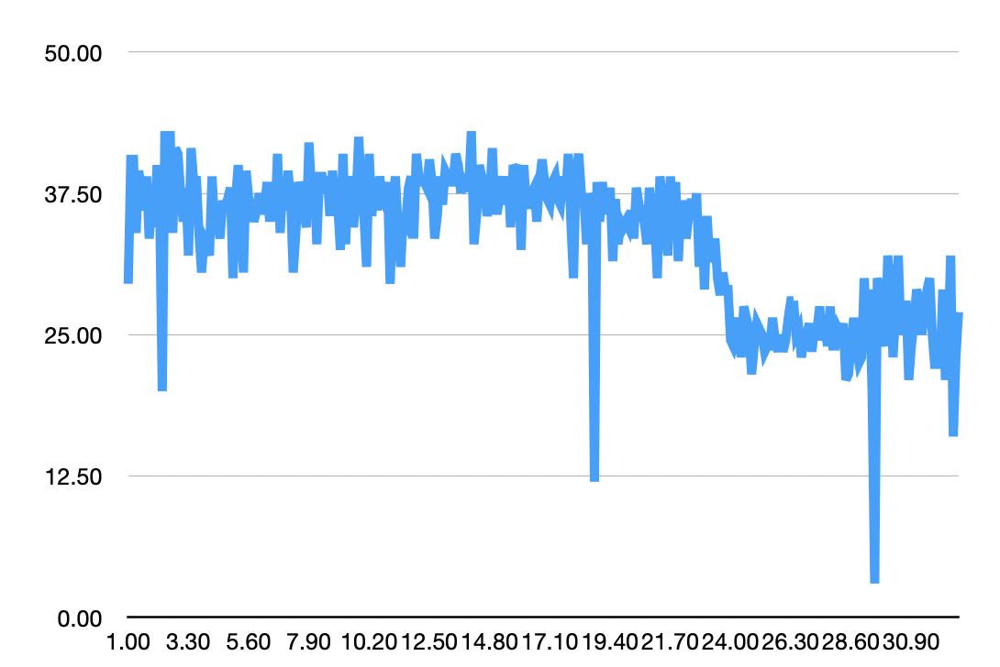
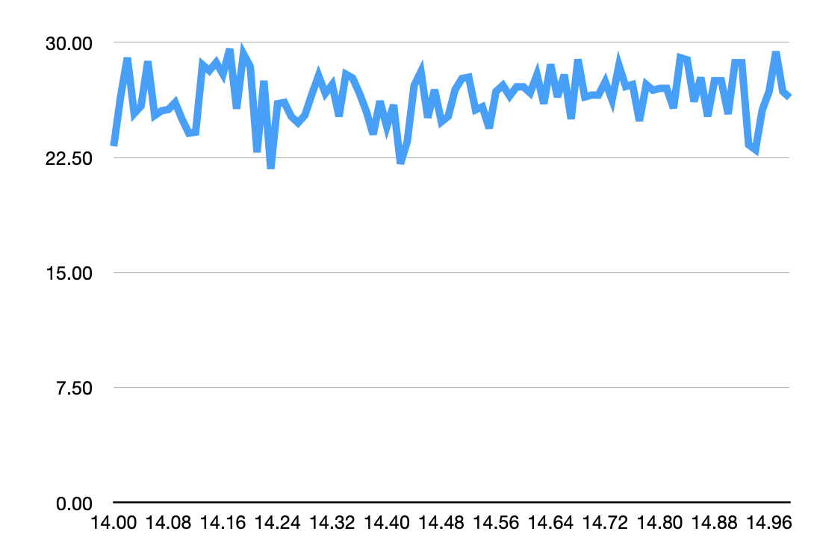
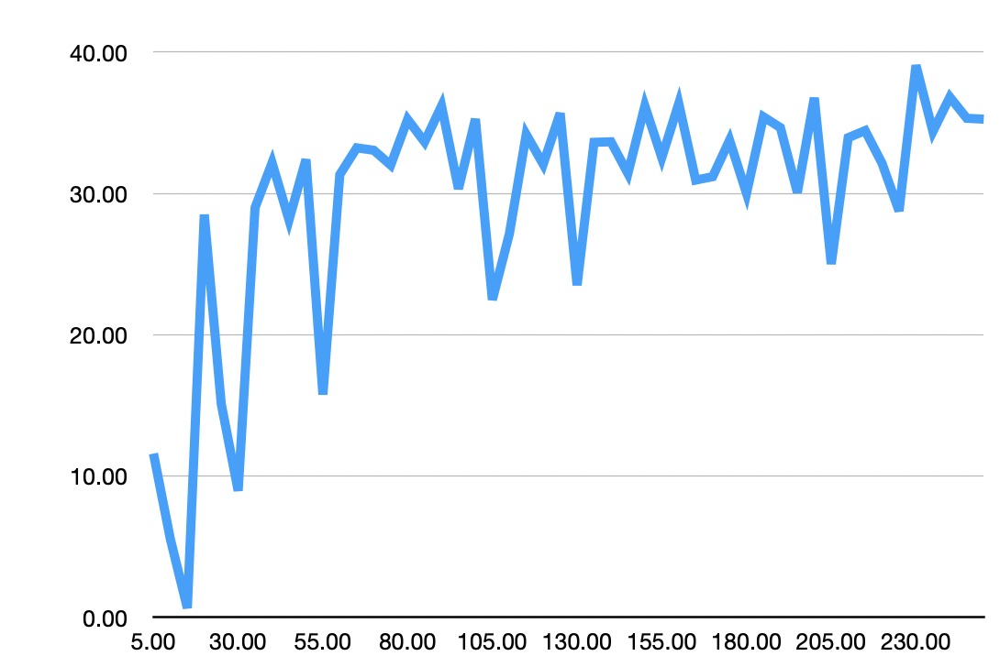
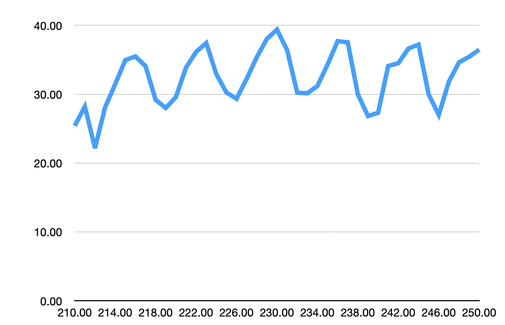

# OOK Tuning

As part of 5.x release I put a LilyGo board I have thru some testing to see if tweaking the `knobs` may dramatically impact signal reception.

I twisted the knobs on 2 settings, Bitrate and Rx Bandwidth, and ran two series of tests with each setting, to see what the impact was.

## BitRate

This was a test of the BitRate setting, stepping by 0.1 from 1 to 32.7.

This a deeper look at reception around 14, stepping by 0.01

Highest count was at 2.4, with an average of 43.00 signals received.  Current setting is 1.2, so 2.4 is a doubling of the existing.

## Rx Bandwidth

This was a test of the Rx Bandwidth Setting, stepping by 5 from 5 to 250.

This is a deeper look at the reception around 230, stepping by 1 from 210 to 250.

Highests count was at 230, with an average of 39.38 signals received.  Current setting is 250, so 230 is a minor improvement.